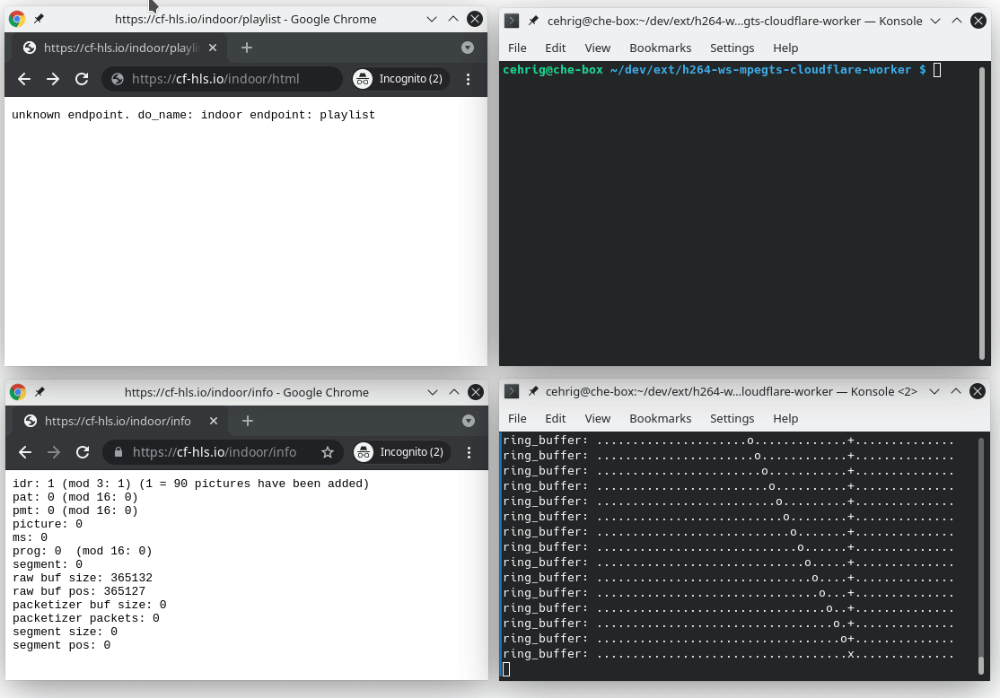

# JS MPEG Transport Stream Multiplexer running in Cloudflare Workers 

This is a lab setup for demonstrating how we can leverage Cloudflare Workers (Durable Objects) to multiplex HLS Segments / an MPEG 
Transport stream in real-time, given a raw raspivid h264 bitstream sent to it via Websockets.

The Durable Object is a very opinionated MPEG Transport Stream multiplexer that is only tested using the options mentioned below. 
It is creating segments and the required playlist on-the-fly.

# Demo
```
H264 bitstream -> Ringbuffer -> Websocket -> Cloudflare Durable Object -> HLS Segments -> Play
```



# 1. Raspivid settings
There is a whole range of requirements for the h264 bitstream, since this is not a rebuild of ffmpeg. The raspivid command that has been used:

```
raspivid -g 30 -stm -ih -if cyclic -md 1 -fps 30 -t 0 -pf baseline -b 6000000 -fl -l -o tcp://0.0.0.0:1025
```
Requirements
- h264 base profile
- 30 frames per second
- 1 NAL Access Unit delimiter (AUD) (the binary in `src/` will add them just like ffmpeg does), followed by
- 1 Sequence Parameter Set (SPS), followed by
- 1 Picture Parameter Set (PPS), followed by
- 1 IDR Picture, followed by
- 29 non-IDR pictures

- `-g 30`, will make sure, we are sending SPS, PPS and IDR Picture every 30 frames
- `-stm`, adds SPS timings

# 2. Send Bitstream via websockets
The binary in `src/` is doing a couple of things and can be started like this

```
./main <IP of raspberry Pi> 1025 <Hostname the worker is running on> <stream name>/ingest
```
It is
- connecting to raspivid on IP/Port (1025 used in the example) and reading the raw h264 bitstream
- slice the bitstream into NAL units
- push NAL units into a ring buffer, by adding AUDs (raspivid does not send AUDs out-of-the-box)
- connecting to our Cloudflare Durable object via websockets
- pull a handful of NAL units from the ringbuffer and send them to the Durable Object

# 3. The Cloudflare Worker
Here is a high-level overview what the Cloudflare Worker is doing
- read websocket messages
- search for 3 consecutive SPS NAL units (we are creating 3 seconds segments) & push to the Muxer
For each 3 seconds segment
- add Transport Stream Header
- add Program Association Table (PAT)
- add Program Map Table (PMT)
- add Adaptation field
- add Packetized Elementary Stream (PES) Header
- calculate program clock reference (PCR) and presentation timestamps (PTS)

Finally
- write MPEG-TS segment into Cloudflare Cache

We also need a playlist, so the Worker is providing an endpoint for loading the HLS Playlist including references to the
3 latest segments.


# Optional Slack logging
```
wrangler secret put SLACK_URL --env SLACK_URL
```